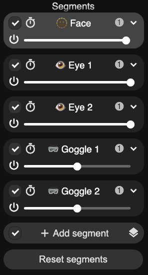
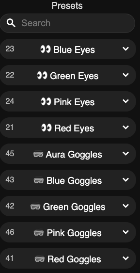
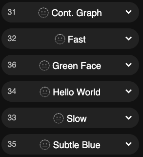

# GitHub Copilot Lamp 3D

A fun and playful lamp to match the energy of GitHub Copilot. It's 3D printable and fairly easy to assemble!

- WiFi Connected
- Powered by [WLED](https://kno.wled.ge/)
- Compatibile with [Home Assistant](https://www.home-assistant.io/)

#### Other Fun GitHub Lamps

- [Copilot Lamp (2D)](https://github.com/chriswblake/github-copilot-lamp)
- [Octolamp](https://github.com/martinwoodward/octolamp)

## Build your own 🤓

That's cool and all, but how do I make one?!  
Check out the [build your own](docs/build-your-own.md) page for a step-by-step guide. 🧑‍🚀

## How to Use

If you received your lamp prebuilt, is has already been configured and is ready to use. Simply plug it in with a USB cable and power brick with at least 1 amp. The lamp will turn on with an "rainbow" like green effect.

### Connect with the App

1. Ensure you are on the same WiFi network.

2. Download the WLED app.
   - [iOS App](https://apps.apple.com/us/app/wled/id1475695033)
   - [Android App](https://play.google.com/store/apps/details?id=com.aircoookie.WLED)
   - The lamp can also be accessed with web browser by navigating to http://copilot-lamp-3d.local.
3. Open the app and the lamp should automatically be discovered.

### Predefined Segments, Presets, and Playlists

There are 5 predefined segments for the face, eyes, and goggles. There are also various example presets that use them to easily adjust the look of Copilot.

Below are some examples of changing the eye color, eye position, and applying animations to the face.

> [!TIP]
> You can also do scrolling text! Check out the "Hello World" example.

### Connect to WiFi

Want full control over your lamp? Connect it to your WiFi network! (2.4ghz only)
If not connected to an existing wifi, it will broadcast a tempory wifi network for setup.

1. On your phone or computer, search for the wifi network `copilot-lamp-3d` and connect to it.
   - Default password is `copilot-lamp-3d` or `wled1234`.
1. Wait a moment and a temporary login-style web browser will appear. If no browser appears, open a web browser navigate to http://copilot-lamp-3d.local.
1. In the top right, click the **Config** gear icon to open the settings menu.
1. Select **WiFi Setup**.
1. Enter you home's wifi name and password. Click **Save & Connect**. Wait a moment for the lamp to restart.
1. Reconnect your phone or computer to your home wifi.

### Example Animations

<table>
<tr>
<td>
    
</td>
<td>
    
</td>
<td>
    
</td>
<td>
    
</td>
</tr>
</table>
