# Guide: Build Your Own 

The copilot lamp is fairly easy to assemble with a bit of soldering. The hardest part is patiently waiting for all the parts to print! 😉

In short, it is a few 3D printed parts, a microcontroller, some LEDs and a few wires to connect it all together.

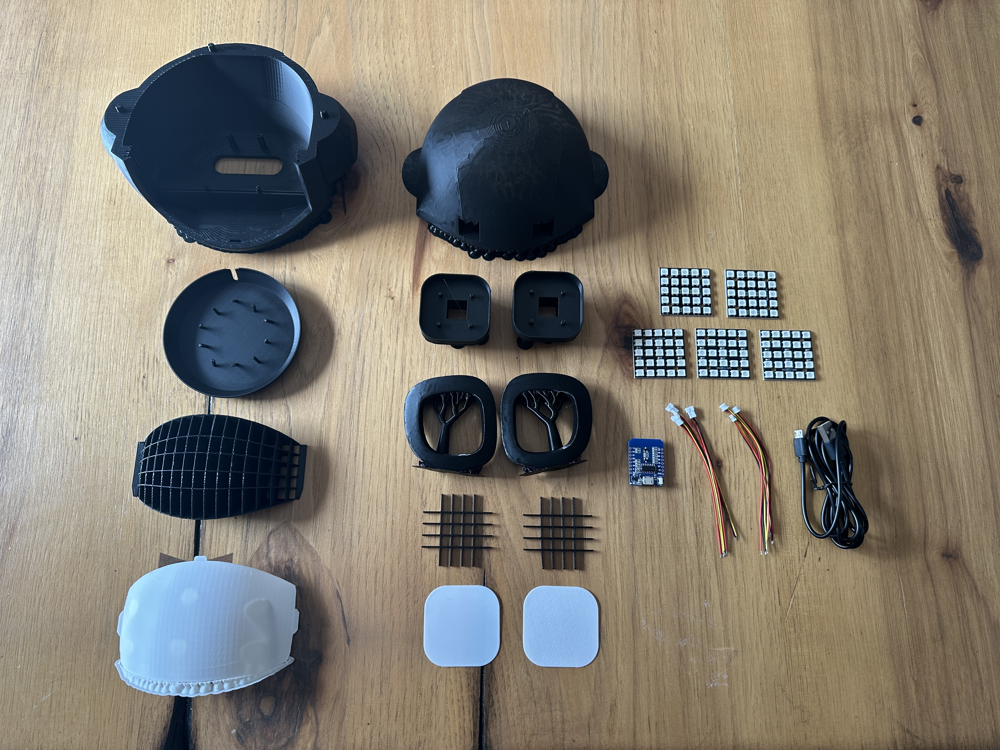

## 1. Buy the materials

### Materials

- Black PLA Filament [[US]](https://us.store.bambulab.com/products/pla-basic-filament?variant=41078274654344)
- White PLA Filament [[US]](https://us.store.bambulab.com/products/pla-basic-filament?variant=41078274687112)
- (5 Qty) WS2812B Addressable LED Matrix (5x5) Panels [[US]](https://www.amazon.com/dp/B0FLX51BXZ)
- ESP8266 Microcontroller micro-USB + WiFi [[US]](https://www.amazon.com/dp/B081PX9YFV)
- (3 Qty) Micro JST Cable Sets [[US]](https://www.amazon.com/dp/B07DL4FNTF)
- Long micro-USB cable. [[US]](https://www.amazon.com/dp/B0CGDPS336)

> [!TIP]
> You can also use USB-C. I personally do micro-USB because the board and power cables are cheaper.

### Tools

- Soldering Iron + Solder
- 3D Printer (min 200x200 print area)
- Pliers

> [!TIP]
> Don't have a 3D printer? Check if your local library has a makerspace.  
> They might be able to print the parts for you! 🤩

## 2. Print the parts

The model (`.stl`) files for all of the printable parts are in the `/components` folder.

## 1. Print the parts
The .STL files for all of the printable parts are in the `/models` folder.

> [!IMPORTANT]
> Supports are required for several parts.
> Please check your slicer results before printing.

| Image                                                         | Part                    | Description                                                         |
| ------------------------------------------------------------- | ----------------------- | ------------------------------------------------------------------- |
| 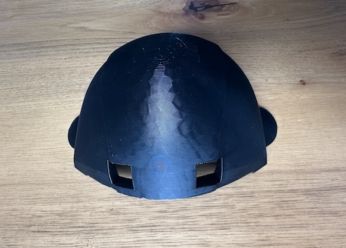        | Helmet Top              | ???                                                                 |
| 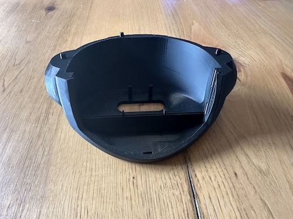     | Helmet Bottom           | Holds the microcontroller, LEDs, and face panel.                    |
| 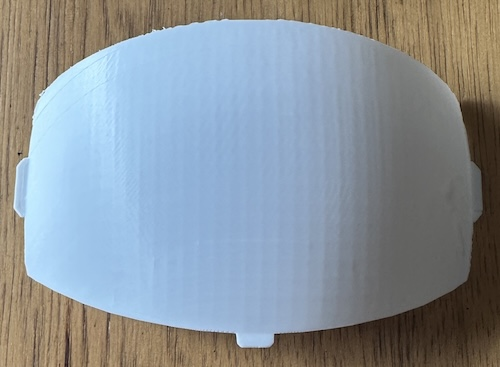        | Face Panel              | Semitransparent face shield for the LED to glow through.            |
|     | Face LED Guide          | Maps the light from the LEDs to pixels on the face panel.           |
|      | Goggle Frames 1 & 2     | Snaps onto the Goggle holder to give it the correct shape.          |
| 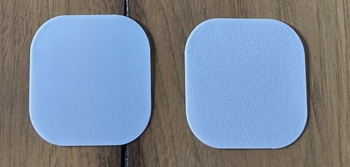       | Goggle Lens 1 & 2       | Diffuses the LEDs.                                                  |
| 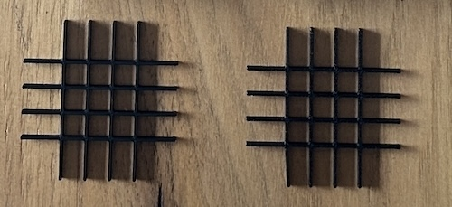 | Goggle LED Guides 1 & 2 | Maps the light from the LEDs to pixels on the face panel.           |
|     | Goggle Holders          | Contains the LEDs for a single Goggle and mounts to the helmet top. |
|       | Thruster (USB)          | Space for securing the USB cable or creating an alternative base.   |

## 3. Prepare the Microcontroller

Let's install the software that will control our LEDs,
and configure the regions for easily changing the face, eyes, and googles.

### 3.1 Install WLED

1. Connect the microcontroller to your computer using a USB cable.
1. Open a web browser and navigate to the [WLED install page](https://install.wled.me/).
1. In the drop down, ensure version `0.15.x` is selected.
1. Click the **Install** button and a window will appear.
1. Select the USB serial device.
   - If no device is appearing, follow WLEDs tips about installing drivers.
   - Tip: Newer Macs seem to not include the driver by default anymore.
1. Follow the instructions and wait a few minutes to install.
   - If this seems to have trouble, try a another board.
1. When asked, enter your WiFi details.
   - Accessing the device locally is required to upload the configuration.
1. When the install is finished, click the **Visit Device** button.

### 3.2 Configure WLED

Let's upload a configuration for the device's LED orientation, and then presets to assign regions with names like "Face", "Eye", and "Goggle".

1. On the device's main page, in the top right, click the **Config** button.

2. Scroll to the bottom and select **Security and Updates**.

3. Find the **Backup & Restore** section.

4. For the **Restore Presets** option. Upload the following file.

   File: [`/wled/presets_playlists.json`](../wled/presets_playlists.json)

   This will install the following:

   - Segments defininig the face, eyes, and goggles.
   - Presets with example face animations.
   - Presets with example goggle animations.
   - Presets with example eye colors and locations.
   - A playlist to apply a combination of presets on boot.

5. For the **Restore Configuration** option, upload the following file.

   File: [`/wled/configuration.json`](../wled/configuration.json)

   This will install following:

   - Set the device to use 124 LEDs and max 1 amp power.
   - Assign a 2D layout for the 5 LED matrix panels.
   - Configure a timer option to turn on the lamp at 9am and off at 5pm. - Enable the option to broadcast a WiFi network named `copilot-lamp-3d`, if no WiFi is found.
   - Configure a timer option to turn on the lamp at 9am and off at 5pm.
   - Set the device's network name to `copilot-lamp-3d`.

### 3.3 Attach the LED cable

1. Attach a **socket-style** JST cable to the microcontroller.

   - Red Wire: `5V` (power)
   - Black Wire: `G` (ground)
   - Yellow Wire: `D4` (digital)

   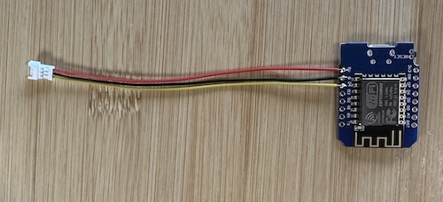
   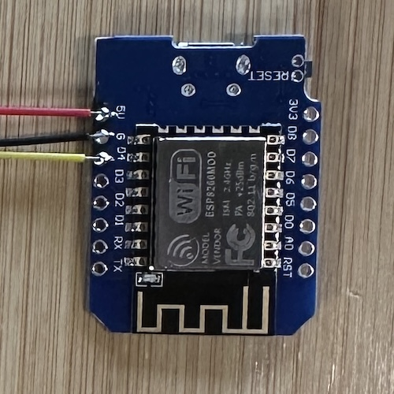

## 4. Prepare the Face LEDs

Let's connect 3 LED matrix boards together. This will be the lights for Copilot's face.

1. Align 3 of the matrix boards with the text facing the same direction. Tape them together.

   > ⚠️ **Warning:** The Orientation must be correct.
   > `DIN` will align with `DOUT` on the board next to it.

   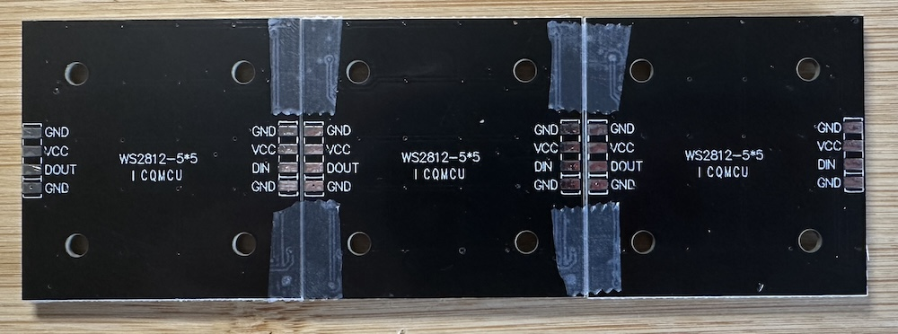

2. Link the boards by soldering them together. Only 1 `GND` is necessary per connection.

   

   > 🪧 **Note:** Soldering can be difficult, especially across a gap. Just be patient and keep trying. 🧐

3. Attach the JST cables.

   - Make sure the cables run toward the middle, not outwards.
   - Make sure the cables do not extend past the edge of the panel. Otherwise, it will not slide into the mounting slot.
   - Pay attention to the cable location and type.

     - `DIN` (right side) uses a plug-style cable.
     - `DOUT` (left side) uses a socket-style cable.

   - Pin mapping
     - Red Wire: `VCC` (power)
     - Black Wire: `GND` (ground)
     - Yellow Wire: `DIN` or `DOUT` (digital)

   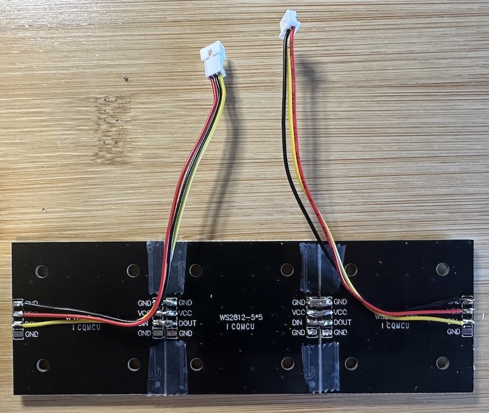

## 5. Prepare the Goggles LEDs

Let's prepare 2 LED matrix boards for Copilot's goggles.

- One has both a plug-style cable and socket-style cable.
- One has only a plug-style cable.

   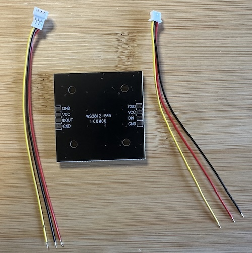
   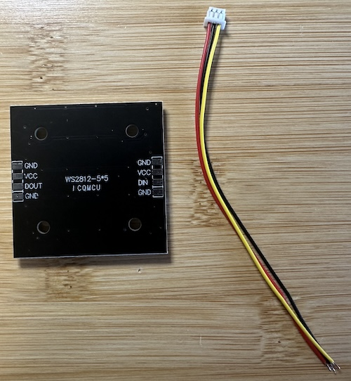

1. With one LED matrix, attach both a **socket-style** and **plug-style** cable.

   - Make sure the cables run toward the middle, not outwards.
   - Pay attention to the cable location and type.

     - `DIN` (right side) uses a plug-style cable.
     - `DOUT` (left side) uses a socket-style cable.

   - Pin mapping
     - Red Wire: `VCC` (power)
     - Black Wire: `GND` (ground)
     - Yellow Wire: `DIN` or `DOUT` (digital)

   

1. With another LED matrix, attach a **plug-style** cable.

   - Make sure the cables run toward the middle, not outwards.
   - Pin mapping
     - Red Wire: `VCC` (power)
     - Black Wire: `GND` (ground)
     - Yellow Wire: `DIN` (digital)

   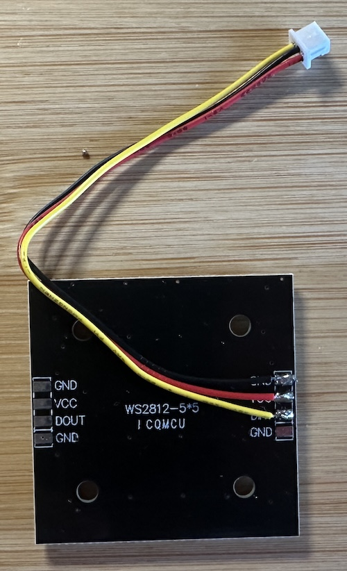

1. Connect the 3x LED panel and the 2 goggle LED panels.
1. Connect the LEDs to the microcontroller.
1. Plug in the USB cable to apply power.
1. The LEDs should randomly glow rainbow colors.

## 3. Main Assembly

### Face Install

1. Collect the 3x LED panel, Helmet Bottom, and Face parts.

2. Slide the 3x LED panel into the second groove.

3. Slide the Face into the first groove.

### Goggles Install

1. Collect Goggle Frames 1 & 2, both Goggle Holders, both Lens, and the 2 single LED Matrix panels.

2. Slide the cables for an LED panel through the hole of a Goggle Holder.

3. Align the pins and push down to attach the LED panel. It will hold by friction.

   > 🪧 **Note**: Orientation does not matter yet.

4. Select a Goggle Frame and insert a lens. It will hold by friction.

5. Slide the combined Goggle Frame + Lens over a Goggle Holder.

   - Goggle Frame 1: Double cabled LED panel
   - Goggle Frame 2: Single cabled LED panel

   > ❗️ **IMPORTANT:** Double-check the frame orientation!
   > Compare the shape and text on the LED matrix to align.

5. Insert Goggle 1 into Helmet Top (left side if looking at Copilot).

5. Insert Goggle 2 into Helmet Top (lefrightt side if looking at Copilot).

### Microcontroller Install

1. Insert the microcontroller into the Helmet Bottom.

1. Twist the USB cable around some of the left cable guides and pinch it into the holder.

1. Connect the LED Matrix cable cables to the microcontroller.

## 4. Final Assembly

1. Apply power and verify all lights turn on.

2. Wait a moment and verify WiFi activates.

3. Insert the pins into Helmet Bottom.

4. Slide Helmet Top onto Helmet Bottom.

1. You are finished! See the main [README](../README.md) for usage info. Plug it in and enjoy!

## Other Advanced Tasks

### Switch to USB-C.

- ESP8266 Microcontroller USB-C + WiFi [[US]](https://www.amazon.com/dp/B0BHW1CNCM)
- Short USB-C Extension [[US]](https://www.amazon.com/dp/B01D8FMPP6)

## Troubleshooting

### Reset Device 

- Reset WiFi: hold button 0 for >6 seconds.
- Reset WLED: hold button 0 for >12 seconds.

# Reference

## Manually Configure

These are the settings for manually configuring a device the same
as the premade configuration file.

### LED Preferences

- Maximum current: 850mA
- WS281x
- GPIO 2
- Turn LEDs on after power up/reset: checked

### WiFi Setup

DNS address: copilot-lamp-3d.local
AP SSID: copilot-lamp-3d
AP Pass: copilot-lamp-3d
Disable WiFi Sleep: checked

